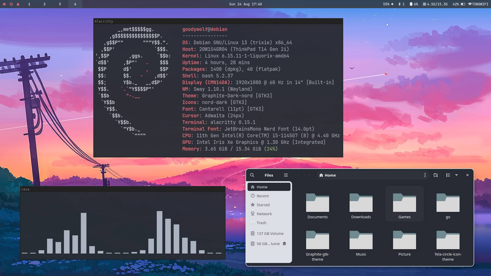

# Thinkpad T14 gen 2(intel) + Debian 13 w/ Sway

> This guide made for Thinkpad T14 gen 2 (intel) if they're running to some problem using linux + who want to try on tilling window manager

SECTION:
1. [Fix Thinkpad Wifi / Hardware Support](https://github.com/Tong-ST/debian_sway?tab=readme-ov-file#thinkpad-t14-gen-2-intel-setup)
2. [Installing Debian 13 + Liquorix Kernel](https://github.com/Tong-ST/debian_sway?tab=readme-ov-file#debian-13-trixie--liquorix-setup)
3. [Installing Sway with shipped DE Like Gnome](https://github.com/Tong-ST/debian_sway?tab=readme-ov-file#sway-setup)
4. [Installing Barebone Debain with only Sway](https://github.com/Tong-ST/debian_sway?tab=readme-ov-file#go-all-in-barebone-debian--sway-no-others-de)
5. [Bug Report](https://github.com/Tong-ST/debian_sway?tab=readme-ov-file#bug-are-might-still-found-with-my-own-testing)
6. [Useful References](https://github.com/Tong-ST/debian_sway?tab=readme-ov-file#references)

**Make sure to check every section before Skipping for example if you want to go with barebone debain + sway you still need to do debian setup + sway setup + barebone debian**

## Thinkpad T14 gen 2 (intel) Setup
***IF YOU DO NOT HAVE ANY HARDWARE SUPPORT PROBLEM YOU CAN *SKIP* THIS SECTION***
> How to detect if your hardware not fully fuction?
- One way to see is when you boot up into distro the green [OK]... is not all checked
#
So, If you use Thinkpad T14 gen 2 like me that using *INTEL AX201 wifi card* (maybe others model as well) and have problem with <b> Wifi not working correctly </b> or others hardware that not support out of the box here's you might need to check

1. Make sure wifi connection <b>ALL Enable </b> in BIOS (even the one that said UEFI wifi connection) TO DO that
    1. in BIOS go to Security > Enable Secure boot (my Thinkpad model need enable secure boot for enable UEFI wifi connection)
    2. Once you enable UEFI wifi connection Then you can disable secure boot after, You actually need to disable secure boot to use custom kernel like Liquorix that i use in my debian
    3. When boot back to system and still not work try:
        ```
        sudo apt install firmware-linux firmware-iwlwifi 
        sudo modprobe -r iwlwifi
        sudo modprobe iwlwifi 
        ```
        - If you run into wifi problem again:
            1. Try redo those command
            2. ON/OFF secure boot (But keep UEFI wifi connection always enable)
            3. Switch between kernel
2. Upgrade Linux kernel to newer version might find the guide how to somewhere it's different per distro but In debian I just upgrade with [ Liquorix](https://liquorix.net/) (Detail at Debian setup) This help me fix a lot of hardware problem

3. Alternative, if thing still break and you can't find the way to fix it try install older version that you machine ship with for example [Thinkpad linux support](https://support.lenovo.com/us/en/solutions/pd031426-linux-for-personal-systems) not sure this way is really necessary these day since patch and support usaully ship with newer Linux kernel

> Hope those help for some folk that have same problem as me...if everything work correctly, Now let's move to next step about Distro setup

## Debian 13 (Trixie) + Liquorix Setup
For Debian setup if newly install just do regular sudo update/upgrade stuff
Than we can move on install / fix some stuff
> For debian you might need to give sudo to your main user to do that
    
1. Get access to root using ``` su - ```
2. Run this command 
    ``` 
    apt install sudo -y
    usermod -aG sudo YOURUSERNAME
    ```
3. Logout / Restart and test using ``` sudo apt update ```

***AGAIN, IF YOU DON'T HAVE ANY HARDWARE SUPPORT PROBLEM STICK WITH DEFAULT KERNEL THAT SHIP WITH DEBIAN AND YOU CAN SKIP THIS SECION BELOW***

If done setup the basic then move to next step
- In this setup I will be install Liquorix as linux Kernel that give debian to newer kernel version this help me fixes a lot issue dealling with hardware support for Thinkpad T14 gen 2(and might work on some closer model)
    - Install Liquorix on Debian
        1. install " curl " if not already and add repo
            ```
            sudo apt install curl -y
            curl 'https://liquorix.net/add-liquorix-repo.sh' | sudo bash 
            ```
        2. install " Liquorix "

            ``` 
            sudo apt update
            sudo apt install linux-image-liquorix-amd64 linux-headers-liquorix-amd64
            ```

        3. Restart ``` reboot ``` and make sure ***SECURE BOOT*** (BIOS) is now ***DISABLE*** in orders to start using ***liquorix***
        4. To verify ``` uname -r ``` to check kernel version if it say 6.x.xx-x-liquorix-amd64(or some like that) Now you on.

Optional step if debian doesn't fully support language out of the box like me (Thai language) You've to install for yourself 

For example of Thai language :
1. Install fonts ``` sudo apt install fonts-thai-tlwg  ```
2. Eeconfigure locales ``` sudo dpkg-reconfigure locales ``` choose you locales and update it

## Sway Setup 
> Nothing Fancy here just simple setup that you can expand...

Now for the fun part, If you not plan to using *Tiling window manager* you already done setup the basic ready to use Thinkpad with Debian 13 x liquorix kernel

But if you not done yet, Let's do some customized! 




**RECOMMENDED do step-by-step BELOW in others desktop enviroment like GNOME before switch to sway in later step**

1. ***FIRST STEP* Install Sway and Dependencies**

    This setup will install **flatpak** and use some flatpak app in .config file, If you not going to use flatpak you can change it in .config file
    
    Install basic need
    ``` 
    sudo apt install sway swaybg swaylock swayidle \
    waybar grim slurp wl-clipboard fuzzel alacritty mako-notifier \
    brightnessctl pavucontrol blueman xdg-desktop-portal-wlr \
    network-manager network-manager-gnome gnome-calendar \
    gnome-system-monitor thunar fonts-font-awesome
    ```

    Also install " tlp " for Thinkpad/laptop power management
    ```
    sudo apt install tlp tlp-rdw acpi-call-dkms
    sudo systemctl enable tlp && sudo systemctl start tlp
    ```

    Setup flatpak to use with debian
    ```
    sudo apt install flatpak
    flatpak remote-add --if-not-exists flathub https://dl.flathub.org/repo/flathub.flatpakrepo
    ```
    Setup some flatpak app that use in my .config file

    ```
    flatpak install flathub app.zen_browser.zen
    flatpak install flathub com.github.d4nj1.tlpui
    ```
    For **Nvidia** users you might need to check **nouveau** work properly 
    ```
    sudo dmesg | grep nouveau
    ```
    NOTE: You don't have to install zen or tlpui but you have to change **default browser in .config** file to your liking
    and Have to change **"on-click": "NEW APP"** for battery in **waybar config** file
2. ***AFTER* Install all requirement now let's make it happen**

    Install git & clone this repo if not already
    ```
    sudo apt install git
    git clone https://github.com/Tong-ST/debian_sway.git
    ```
    Copy .config file to your device or Manually copy files in configs folder to ~/.config/
    ```
    cp -r debian_sway/configs/ ~/.config/
    ```
    Install JetBrains Mono Nerd Font for Fonts and Icons used
    ```
    wget -P ~/.local/share/fonts https://github.com/ryanoasis/nerd-fonts/releases/download/v3.0.2/JetBrainsMono.zip
    cd ~/.local/share/fonts
    unzip JetBrainsMono.zip
    rm JetBrainsMono.zip
    fc-cache -fv
    ```
3. ***JUMP IN* to sway**
    
    But before jump right in, If you're new keep this keybinding in mind.
    
    - ``` WIN+SHIFT+E ``` = Logout from Sway so you can go back to others DE in-case something went wrong
    - ``` WIN+SHIFT+W ``` = Close window/application
    - ``` WIN+SHIFT+C ``` = Reload sway config file to see chagnes (Error might show, better fix what's wrong before move on)
    - ``` WIN+D ``` = Search for app using fuzzel
    - ``` WIN+ENTER ``` = Open alacritty terminal
    - ``` WIN+Z ``` = Open your browser default with Zen

    And in default sway install and this config here we use **swaylock / swayidle** it will lockscreen when inactive It just going to be blackscreen when LOCK and you can UNLOCK by typing your login PIN then ENTER (Backspace to clear before typing)
    
    **Now you ready to drive in to Sway**
    - First thing to do is check in .config file and read it and change for your liking ``` sudo nano ~/.config/sway/config ```
    - something you might want to do is switch between language currently using ``` CTRL+ALT ``` and it switch between US & TH *read near end of rows in config file* you will see where to change
    - Change wallpapers in .config file you'll see in very first page just change path to your background keep ' fill ' at the end

## GO ALL-IN? (Barebone debian + Sway No others DE)
> This section is for more advance user, If you want to go with just sway and no others DE, mean less bloated but easy to break!!! Also this section is more like experimental, You might have to thinkering it to work, But here just provide some package you need to get start with

This section can do after install or alongside with Sway install section abrove mostly just package that might doesn't come with shipped DE

If you very new, First thing might need install is just ``` apt install sudo -y ``` do within root that can access by ``` su - ``` which is already explain in debian installation abrove

- CORE PACKAGE
    ```
    sudo apt install wayland-protocols xwayland curl python3-pip pipx htop libinput-tools\
    xserver-xorg-core mesa-utils pipewire pipewire-audio wireplumber mate-polkit
    ```
    If your GPU support vulkan also install ``` sudo apt install mesa-vulkan-drivers ```

- LOGIN MANAGER or autologin see in sway wiki in references section for 
    ```
    sudo apt install greetd wlgreet
    sudo systemctl enable greetd
    ```
    - ADDITIONAL CONFIG ``` sudo nano /etc/greetd/config.toml ```
    **uncomment line *below*** of if you using **wlgreet**
    
    - For Login without login manager you can just enter your username + password then enter ``` sway ``` to enter swaywm and it work everytime!

- UTILITES
    ```
    sudo apt install gvfs xdg-utils firefox-esr clipman gparted vlc swayimg timeshift
    ```
- FONTS
    ```
    sudo apt install fonts-dejavu fonts-noto fonts-noto-color-emoji fonts-font-awesome
    ```

More optional **tlp** config it's depend on your machine but if you want to use my **personal config** you can ``` sudo cp -r debian_sway/custom_conf/tlp.conf /etc/ ``` but i **extremely recommend** to config for your own machine needed

> ***AND ABOUT IT!***, It cover most basic setup, now you can install stuff & customize to you liking, Thanks if you stick to the end of this long long guide...

## Bug are might still found (with my own testing)
- Graphical Glitches when install in VM it mostly on VM don't handle wayland very well you have to find you own solution for VM use for example. use different video render method
- When exit get error: [common/ipc-client.c:86] unable to receive IPC response (But known to be harmless, If i find solution i will updated)
- My Thinkpad T14 gen 2(i) sometime still got wifi not found, I just redo stuff detail on first section, If found better solution will put it there

## References
Recommend to check Sway community doc below

- [Sway wiki](https://github.com/swaywm/sway/wiki)
- [Useful Add-on for Sway](https://github.com/swaywm/sway/wiki/Useful-add-ons-for-sway)
- [Debian - Sway wiki](https://wiki.debian.org/sway)
